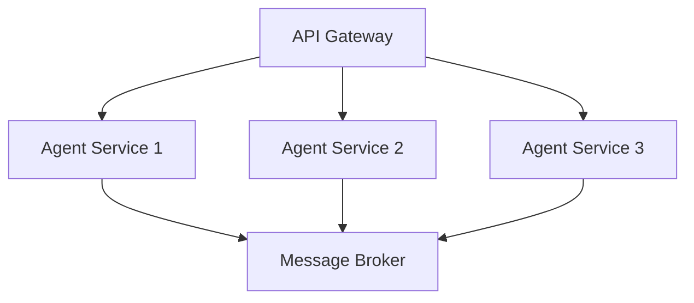
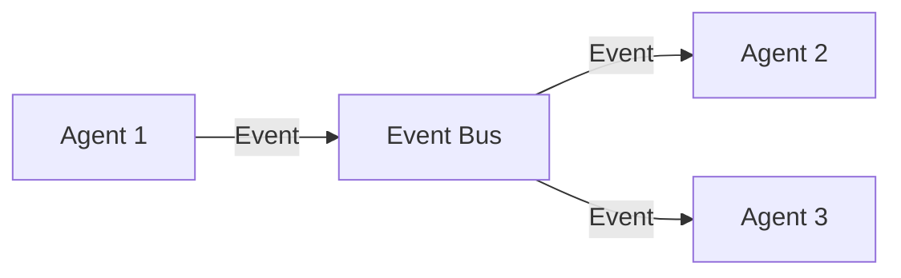

# Multi-Agent Systems (MAS)

This section covers everything you need to know about building and managing Multi-Agent Systems, from basic concepts to advanced implementations.

## 🎯 Learning Paths

### For Interns & Junior Developers
- Start with [Basic Concepts](basics/README.md)
  - What are Multi-Agent Systems?
  - Real-world examples and analogies
  - Simple agent interactions
  - Hands-on exercises with basic agent communication

### For Mid-Level Developers
- Move to [Core Implementations](core/README.md)
  - Agent communication patterns
  - Task hand-offs
  - State management
  - Practical examples and code walkthroughs

### For Senior Developers
- Advanced topics in [Advanced Patterns](advanced/README.md)
  - System architecture
  - Performance optimization
  - Scalability considerations
  - Industry best practices

## 📚 Topics

### 1. Types of MAS
- [Hierarchical Systems](types_of_mas.md#hierarchical-mas)
  - Parent-child relationships
  - Command flow
  - Real-world example: Corporate management structure
- [Peer-to-Peer Systems](types_of_mas.md#peer-to-peer-mas)
  - Direct communication
  - Distributed decision making
  - Real-world example: Blockchain networks
- [Market-Based Systems](types_of_mas.md#market-based-mas)
  - Resource allocation
  - Bidding mechanisms
  - Real-world example: Cloud computing resource markets
- [Swarm Systems](types_of_mas.md#swarm-mas)
  - Collective behavior
  - Emergent patterns
  - Real-world example: Drone swarms

### 2. Communication Patterns
- [Message Passing](communication_patterns.md#message-passing)
  - Message types and formats
  - Routing mechanisms
  - Error handling
- [Protocols](communication_patterns.md#protocol-implementation)
  - Request-response
  - Publish-subscribe
  - Contract net
- [Coordination](communication_patterns.md#coordination-mechanisms)
  - Consensus building
  - Task distribution
  - Conflict resolution

### 3. Hand-offs
- [Task Transfer](hand_offs.md#task-transfer)
  - State preservation
  - Context transfer
  - Error recovery
- [State Management](hand_offs.md#state-management)
  - State synchronization
  - Conflict resolution
  - Consistency guarantees

### 4. Agent-to-Agent Protocol
- [Message Format](a2a_protocol.md#message-format)
  - Standardized formats
  - Priority levels
  - Metadata handling
- [Protocol Implementation](a2a_protocol.md#protocol-implementation)
  - Message routing
  - Validation
  - Error handling

### 5. Multi-Agent Control Protocol (MCP)
- [Control Protocol](mcp.md#control-protocol)
  - Command structure
  - Priority management
  - State tracking
- [System Management](mcp.md#system-management)
  - Resource allocation
  - Performance monitoring
  - Fault tolerance

## 🛠️ Tools & Frameworks

### Development Tools
- [MASON](https://cs.gmu.edu/~eclab/projects/mason/) - Multi-Agent Simulation Toolkit
- [JADE](https://jade.tilab.com/) - Java Agent Development Framework
- [SPADE](https://spade-mas.readthedocs.io/) - Smart Python Agent Development Environment

### Monitoring & Debugging
- [Prometheus](https://prometheus.io/) - Metrics collection
- [Grafana](https://grafana.com/) - Visualization
- [Jaeger](https://www.jaegertracing.io/) - Distributed tracing

## 📈 Industry Applications

### Finance
- Algorithmic trading systems
- Risk assessment networks
- Fraud detection systems

### Healthcare
- Patient monitoring networks
- Resource allocation systems
- Emergency response coordination

### Transportation
- Traffic management systems
- Autonomous vehicle coordination
- Logistics optimization

### Manufacturing
- Production line coordination
- Resource allocation
- Quality control systems

## 🎓 Learning Resources

### Books
- "Multi-Agent Systems: An Introduction to Distributed Artificial Intelligence" by Gerhard Weiss
- "An Introduction to MultiAgent Systems" by Michael Wooldridge

### Papers
- [A Survey of Multi-Agent Systems](https://arxiv.org/abs/2004.07213)
- [Multi-Agent Reinforcement Learning](https://arxiv.org/abs/2004.07213)

### Online Courses
- [Coursera: Multi-Agent Systems](https://www.coursera.org/)
- [edX: Distributed Systems](https://www.edx.org/)

## 🏗️ Architecture Patterns

### Microservices Integration


### Event-Driven Architecture


## 📊 Performance Metrics

| Metric | Description | Target Value |
|--------|-------------|--------------|
| Message Latency | Time to deliver messages | < 100ms |
| System Throughput | Messages per second | > 1000 |
| Error Rate | Failed operations | < 0.1% |
| Resource Usage | CPU/Memory utilization | < 70% |

## 🔍 Best Practices

1. **Design Principles**
   - Loose coupling
   - High cohesion
   - Clear interfaces
   - Fault tolerance

2. **Implementation Guidelines**
   - Use standard protocols
   - Implement proper error handling
   - Monitor system health
   - Document agent capabilities

3. **Deployment Considerations**
   - Scalability
   - Security
   - Monitoring
   - Backup strategies

## 🎯 Exercises & Projects

### Beginner Level
1. Create a simple chat system with two agents
2. Implement basic message passing
3. Build a task hand-off mechanism

### Intermediate Level
1. Design a market-based resource allocation system
2. Implement a consensus mechanism
3. Create a fault-tolerant agent network

### Advanced Level
1. Build a scalable multi-agent system
2. Implement advanced coordination protocols
3. Create a self-healing agent network

## 📈 Evaluation & Testing

### Unit Testing
```python
def test_agent_communication():
    agent1 = Agent("agent1")
    agent2 = Agent("agent2")
    message = Message("Hello", agent1, agent2)
    assert agent2.receive_message(message) == "Hello"
```

### Integration Testing
```python
def test_system_coordination():
    system = MultiAgentSystem()
    system.add_agent(Agent("agent1"))
    system.add_agent(Agent("agent2"))
    result = system.coordinate_task("task1")
    assert result.status == "completed"
```

### Performance Testing
```python
def test_system_performance():
    system = MultiAgentSystem()
    start_time = time.time()
    system.process_messages(1000)
    end_time = time.time()
    assert (end_time - start_time) < 1.0
```

## 🔄 Continuous Integration

### GitHub Actions Workflow
```yaml
name: MAS CI/CD

on: [push, pull_request]

jobs:
  test:
    runs-on: ubuntu-latest
    steps:
      - uses: actions/checkout@v2
      - name: Set up Python
        uses: actions/setup-python@v2
      - name: Install dependencies
        run: pip install -r requirements.txt
      - name: Run tests
        run: pytest
```

## 📚 Further Reading

- [MAS Research Papers](https://arxiv.org/list/cs.MA/recent)
- [Industry Case Studies](https://www.example.com/case-studies)
- [Community Forums](https://www.example.com/forums) 