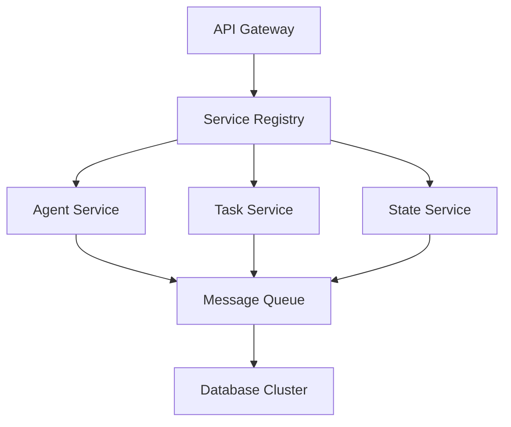
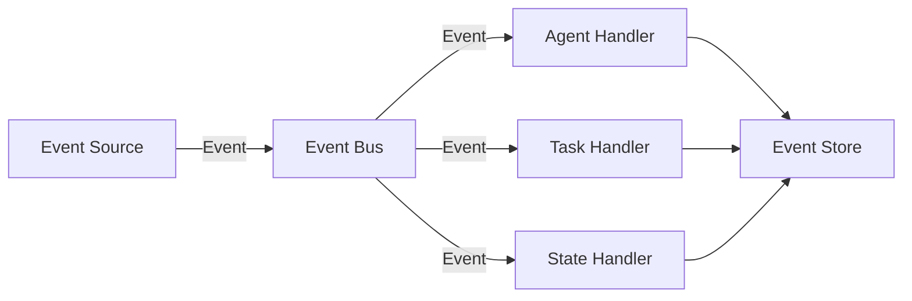

# Multi-Agent Systems: Advanced Patterns

This guide covers advanced patterns and optimizations for Multi-Agent Systems, focusing on scalability, performance, and enterprise-grade implementations.

## 🏗️ Advanced Architecture

### Microservices Architecture


### Event-Driven Architecture


## 🔄 Advanced Communication Patterns

### 1. Event Sourcing
```python
class EventStore:
    def __init__(self):
        self.events = []
        self.snapshots = {}
    
    def append_event(self, event):
        self.events.append(event)
        self._create_snapshot_if_needed(event)
    
    def _create_snapshot_if_needed(self, event):
        if len(self.events) % 1000 == 0:  # Create snapshot every 1000 events
            self.snapshots[event.id] = self._create_snapshot()
    
    def _create_snapshot(self):
        # Create system state snapshot
        pass

class EventSource:
    def __init__(self, event_store):
        self.event_store = event_store
    
    def publish_event(self, event_type, data):
        event = Event(
            id=str(uuid.uuid4()),
            type=event_type,
            data=data,
            timestamp=datetime.now()
        )
        self.event_store.append_event(event)
```

### 2. CQRS (Command Query Responsibility Segregation)
```python
class CommandBus:
    def __init__(self):
        self.handlers = {}
    
    def register_handler(self, command_type, handler):
        self.handlers[command_type] = handler
    
    def dispatch(self, command):
        handler = self.handlers[type(command)]
        return handler.handle(command)

class QueryBus:
    def __init__(self):
        self.handlers = {}
    
    def register_handler(self, query_type, handler):
        self.handlers[query_type] = handler
    
    def dispatch(self, query):
        handler = self.handlers[type(query)]
        return handler.handle(query)
```

## 🎯 Advanced Task Management

### 1. Task Orchestration
```python
class TaskOrchestrator:
    def __init__(self):
        self.workflows = {}
        self.execution_history = {}
    
    def define_workflow(self, workflow_id, steps):
        self.workflows[workflow_id] = steps
    
    def execute_workflow(self, workflow_id, context):
        steps = self.workflows[workflow_id]
        for step in steps:
            result = self._execute_step(step, context)
            if not result.success:
                return self._handle_failure(step, result)
        return ExecutionResult(success=True)
    
    def _execute_step(self, step, context):
        # Execute individual workflow step
        pass
```

### 2. Task Scheduling
```python
class AdvancedScheduler:
    def __init__(self):
        self.tasks = PriorityQueue()
        self.resources = ResourcePool()
    
    def schedule_task(self, task):
        if self._can_schedule(task):
            self.tasks.put(task)
            return True
        return False
    
    def _can_schedule(self, task):
        return self.resources.has_available_resources(task.requirements)
    
    def execute_scheduled_tasks(self):
        while not self.tasks.empty():
            task = self.tasks.get()
            self._execute_task(task)
```

## 🔄 Advanced State Management

### 1. Distributed State
```python
class DistributedStateManager:
    def __init__(self):
        self.state_store = {}
        self.replicas = []
    
    def update_state(self, key, value):
        # Update local state
        self.state_store[key] = value
        # Replicate to other nodes
        self._replicate_update(key, value)
    
    def _replicate_update(self, key, value):
        for replica in self.replicas:
            replica.update_state(key, value)
    
    def get_state(self, key):
        return self.state_store.get(key)
```

### 2. State Synchronization
```python
class StateSynchronizer:
    def __init__(self):
        self.states = {}
        self.version_vectors = {}
    
    def update_state(self, agent_id, state):
        current_version = self.version_vectors.get(agent_id, 0)
        self.states[agent_id] = state
        self.version_vectors[agent_id] = current_version + 1
    
    def synchronize_states(self):
        for agent_id in self.states:
            self._synchronize_agent_state(agent_id)
    
    def _synchronize_agent_state(self, agent_id):
        # Implement state synchronization logic
        pass
```

## 🛠️ Advanced Error Handling

### 1. Circuit Breaker
```python
class CircuitBreaker:
    def __init__(self, failure_threshold=5, reset_timeout=60):
        self.failure_threshold = failure_threshold
        self.reset_timeout = reset_timeout
        self.failures = 0
        self.last_failure_time = None
        self.state = "closed"
    
    def execute(self, func):
        if self.state == "open":
            if self._should_reset():
                self._reset()
            else:
                raise CircuitBreakerOpenError()
        
        try:
            result = func()
            self._on_success()
            return result
        except Exception as e:
            self._on_failure()
            raise e
    
    def _should_reset(self):
        if not self.last_failure_time:
            return False
        return (time.time() - self.last_failure_time) > self.reset_timeout
```

### 2. Retry Mechanism
```python
class RetryMechanism:
    def __init__(self, max_retries=3, backoff_factor=2):
        self.max_retries = max_retries
        self.backoff_factor = backoff_factor
    
    def execute(self, func):
        retries = 0
        while retries < self.max_retries:
            try:
                return func()
            except Exception as e:
                retries += 1
                if retries == self.max_retries:
                    raise e
                time.sleep(self.backoff_factor ** retries)
```

## 📊 Advanced Monitoring

### 1. Distributed Tracing
```python
class Tracer:
    def __init__(self):
        self.traces = {}
    
    def start_trace(self, trace_id):
        self.traces[trace_id] = {
            "start_time": time.time(),
            "spans": []
        }
    
    def add_span(self, trace_id, span):
        if trace_id in self.traces:
            self.traces[trace_id]["spans"].append(span)
    
    def end_trace(self, trace_id):
        if trace_id in self.traces:
            self.traces[trace_id]["end_time"] = time.time()
```

### 2. Metrics Aggregation
```python
class MetricsAggregator:
    def __init__(self):
        self.metrics = defaultdict(list)
    
    def record_metric(self, name, value):
        self.metrics[name].append(value)
    
    def get_statistics(self, name):
        values = self.metrics[name]
        return {
            "count": len(values),
            "mean": statistics.mean(values),
            "std": statistics.stdev(values),
            "min": min(values),
            "max": max(values)
        }
```

## 🎯 Performance Optimization

### 1. Caching
```python
class Cache:
    def __init__(self, max_size=1000):
        self.max_size = max_size
        self.cache = {}
        self.access_count = {}
    
    def get(self, key):
        if key in self.cache:
            self.access_count[key] += 1
            return self.cache[key]
        return None
    
    def put(self, key, value):
        if len(self.cache) >= self.max_size:
            self._evict_least_used()
        self.cache[key] = value
        self.access_count[key] = 1
    
    def _evict_least_used(self):
        least_used = min(self.access_count.items(), key=lambda x: x[1])
        del self.cache[least_used[0]]
        del self.access_count[least_used[0]]
```

### 2. Load Balancing
```python
class LoadBalancer:
    def __init__(self, strategy="round_robin"):
        self.strategy = strategy
        self.servers = []
        self.current_index = 0
    
    def add_server(self, server):
        self.servers.append(server)
    
    def get_next_server(self):
        if not self.servers:
            raise NoServersAvailableError()
        
        if self.strategy == "round_robin":
            server = self.servers[self.current_index]
            self.current_index = (self.current_index + 1) % len(self.servers)
            return server
        elif self.strategy == "least_connections":
            return min(self.servers, key=lambda s: s.connection_count)
```

## 🔒 Security

### 1. Authentication
```python
class AuthenticationManager:
    def __init__(self):
        self.tokens = {}
    
    def authenticate(self, credentials):
        # Implement authentication logic
        pass
    
    def generate_token(self, user_id):
        token = str(uuid.uuid4())
        self.tokens[token] = {
            "user_id": user_id,
            "expires_at": time.time() + 3600
        }
        return token
    
    def validate_token(self, token):
        if token not in self.tokens:
            return False
        token_data = self.tokens[token]
        return time.time() < token_data["expires_at"]
```

### 2. Authorization
```python
class AuthorizationManager:
    def __init__(self):
        self.permissions = {}
    
    def check_permission(self, user_id, resource, action):
        if user_id not in self.permissions:
            return False
        user_permissions = self.permissions[user_id]
        return (resource, action) in user_permissions
    
    def grant_permission(self, user_id, resource, action):
        if user_id not in self.permissions:
            self.permissions[user_id] = set()
        self.permissions[user_id].add((resource, action))
```

## 📚 Best Practices

### 1. System Design
- Use event-driven architecture
- Implement proper error handling
- Design for scalability
- Consider security implications

### 2. Performance
- Optimize resource usage
- Implement caching
- Use efficient algorithms
- Monitor system metrics

### 3. Security
- Implement proper authentication
- Use secure communication
- Protect sensitive data
- Regular security audits

## 🎓 Further Reading

### Books
- "Designing Data-Intensive Applications" by Martin Kleppmann
- "Building Microservices" by Sam Newman

### Papers
- [Distributed Systems](https://arxiv.org/list/cs.DC/recent)
- [System Architecture](https://arxiv.org/list/cs.SE/recent)

### Online Resources
- [System Design Patterns](https://www.example.com/patterns)
- [Enterprise Architecture](https://www.example.com/enterprise)

Remember: Advanced patterns require careful consideration of trade-offs and system requirements. 