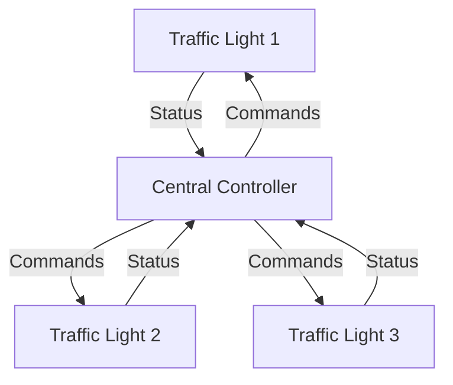
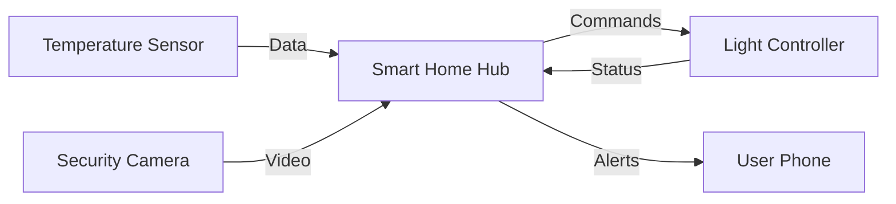
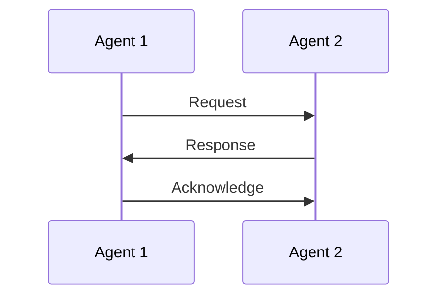
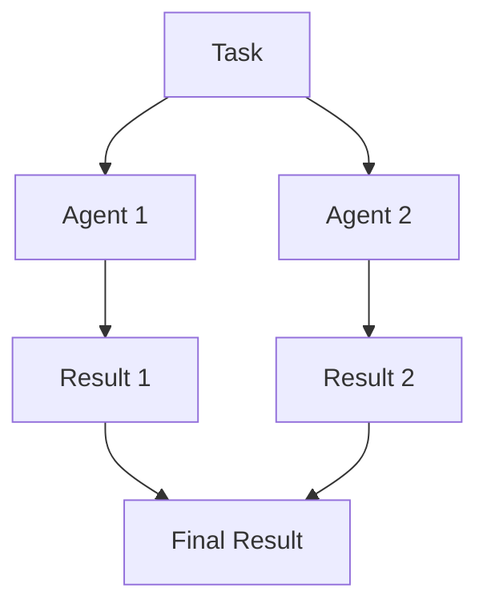

# Multi-Agent Systems: Basic Concepts

Welcome to the world of Multi-Agent Systems! This guide is designed to help you understand the fundamental concepts of MAS using real-world analogies and simple explanations.

## 🤔 What are Multi-Agent Systems?

Think of a Multi-Agent System like a team of robots working together in a warehouse. Each robot (agent) has its own job:
- Some robots pick up items
- Others move items to storage
- Some robots check inventory
- Others handle packaging

Just like in a human team, these robots need to:
1. Communicate with each other
2. Share information
3. Coordinate their actions
4. Help each other when needed

## 🌟 Real-World Examples

### 1. Traffic Light System


Each traffic light is an agent that:
- Monitors traffic
- Communicates with other lights
- Adjusts timing based on traffic flow

### 2. Smart Home System


Each device is an agent that:
- Collects data
- Makes decisions
- Takes actions
- Communicates with other devices

## 🎮 Simple Agent Interactions

Let's look at a simple example of two agents communicating:

```python
class SimpleAgent:
    def __init__(self, name):
        self.name = name
        self.messages = []
    
    def send_message(self, other_agent, message):
        print(f"{self.name} sends: {message}")
        other_agent.receive_message(message)
    
    def receive_message(self, message):
        print(f"{self.name} receives: {message}")
        self.messages.append(message)

# Create two agents
alice = SimpleAgent("Alice")
bob = SimpleAgent("Bob")

# They communicate
alice.send_message(bob, "Hello, Bob!")
bob.send_message(alice, "Hi, Alice!")
```

## 🎯 Hands-on Exercise: Basic Chat System

Let's build a simple chat system with two agents. This will help you understand:
- How agents communicate
- How messages are passed
- Basic agent behavior

```python
class ChatAgent:
    def __init__(self, name):
        self.name = name
        self.chat_history = []
    
    def send_message(self, other_agent, message):
        # Create a message with timestamp
        chat_message = {
            "from": self.name,
            "to": other_agent.name,
            "message": message,
            "timestamp": time.time()
        }
        
        # Send and receive
        print(f"{self.name} sends: {message}")
        other_agent.receive_message(chat_message)
    
    def receive_message(self, chat_message):
        print(f"{self.name} receives: {chat_message['message']}")
        self.chat_history.append(chat_message)
    
    def show_chat_history(self):
        print(f"\nChat history for {self.name}:")
        for msg in self.chat_history:
            print(f"{msg['from']} -> {msg['to']}: {msg['message']}")

# Try it out!
alice = ChatAgent("Alice")
bob = ChatAgent("Bob")

alice.send_message(bob, "Hey Bob, how are you?")
bob.send_message(alice, "I'm good, thanks! How about you?")
alice.send_message(bob, "Doing great! Want to work on a project?")

# Show chat history
alice.show_chat_history()
bob.show_chat_history()
```

## 📝 Key Concepts

### 1. Agent
- An autonomous entity that can:
  - Make decisions
  - Take actions
  - Communicate with others
  - Learn from experience

### 2. Communication
- How agents talk to each other
- Types of messages
- Message formats
- Communication protocols

### 3. Coordination
- How agents work together
- Task sharing
- Resource sharing
- Conflict resolution

### 4. Environment
- Where agents operate
- Rules and constraints
- Available resources
- External factors

## 🎨 Visual Learning

### Agent Communication


### Task Coordination


## 🎯 Practice Exercises

### Exercise 1: Message Passing
Create two agents that can:
- Send messages to each other
- Keep track of message history
- Respond to messages

### Exercise 2: Simple Task Sharing
Create a system where:
- One agent creates tasks
- Other agents can pick up tasks
- Tasks are marked as complete

### Exercise 3: Basic Coordination
Create a system where:
- Agents share resources
- They coordinate their actions
- They avoid conflicts

## 📚 Additional Resources

### Books
- "Introduction to Multi-Agent Systems" by Michael Wooldridge
- "Multi-Agent Systems: An Introduction to Distributed Artificial Intelligence" by Gerhard Weiss

### Online Courses
- [Coursera: Multi-Agent Systems](https://www.coursera.org/)
- [edX: Distributed Systems](https://www.edx.org/)

### Tutorials
- [MAS Tutorial](https://www.example.com/mas-tutorial)
- [Agent Communication](https://www.example.com/agent-comm)

## 🎓 Next Steps

After mastering these basics, you can move on to:
1. [Core Implementations](../core/README.md)
2. [Communication Patterns](../communication_patterns.md)
3. [Task Hand-offs](../hand_offs.md)

Remember: Learning is a journey! Take your time to understand each concept before moving to the next one. 