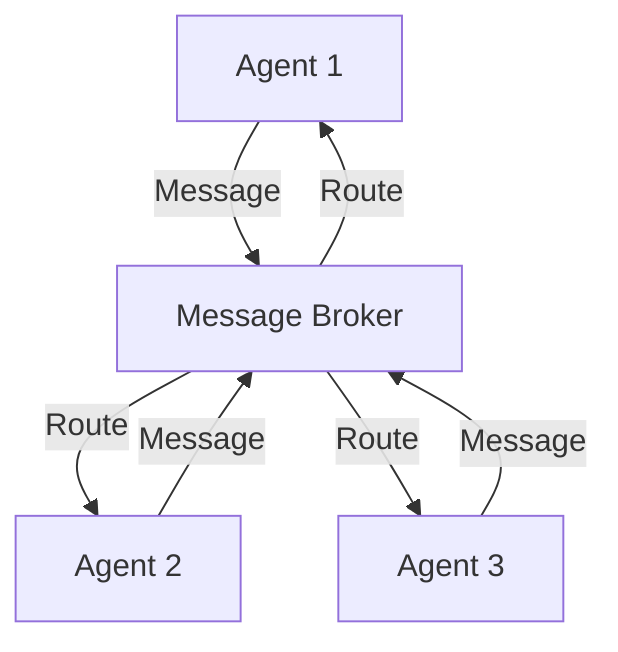
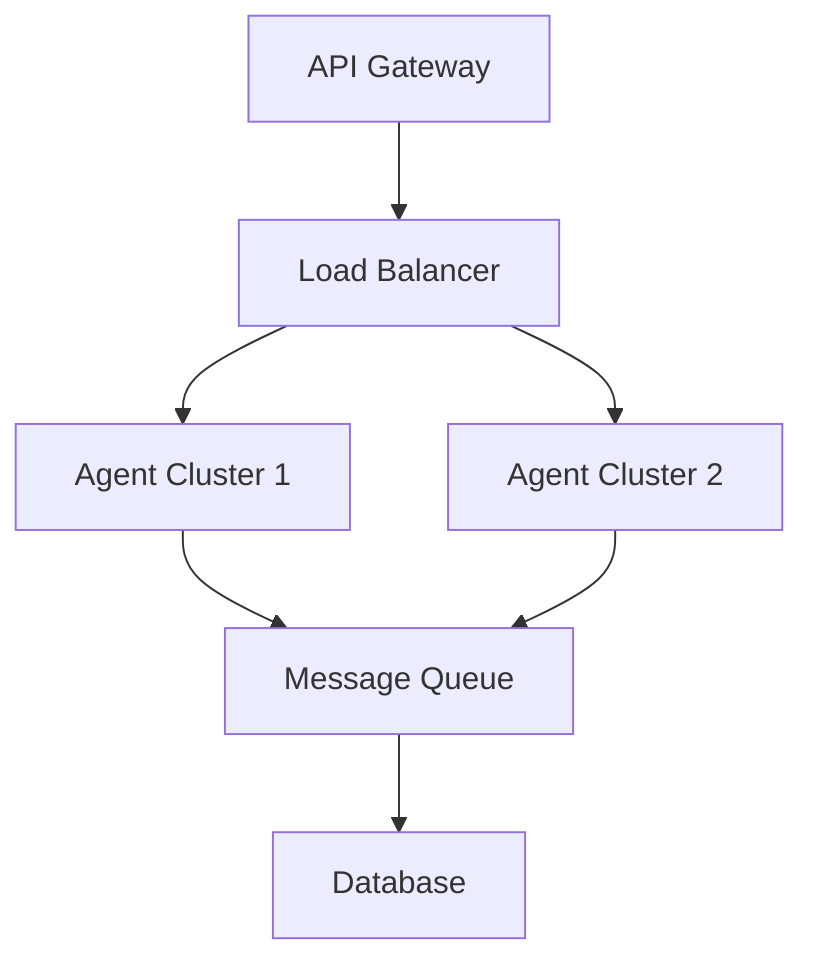

# Multi-Agent Systems: Core Implementations

This guide covers the core implementations of Multi-Agent Systems, focusing on practical patterns and real-world applications.

## 🏗️ System Architecture

### Basic Architecture


### Advanced Architecture


## 💻 Core Components

### 1. Message Broker
```python
class MessageBroker:
    def __init__(self):
        self.queues = {}
        self.subscribers = {}
    
    def create_queue(self, queue_name):
        self.queues[queue_name] = []
    
    def subscribe(self, agent_id, queue_name):
        if queue_name not in self.subscribers:
            self.subscribers[queue_name] = set()
        self.subscribers[queue_name].add(agent_id)
    
    def publish(self, queue_name, message):
        if queue_name in self.queues:
            self.queues[queue_name].append(message)
            self._notify_subscribers(queue_name, message)
    
    def _notify_subscribers(self, queue_name, message):
        if queue_name in self.subscribers:
            for agent_id in self.subscribers[queue_name]:
                # Notify agent
                pass
```

### 2. Agent Manager
```python
class AgentManager:
    def __init__(self):
        self.agents = {}
        self.agent_states = {}
    
    def register_agent(self, agent_id, agent):
        self.agents[agent_id] = agent
        self.agent_states[agent_id] = "idle"
    
    def update_agent_state(self, agent_id, state):
        if agent_id in self.agent_states:
            self.agent_states[agent_id] = state
    
    def get_available_agents(self):
        return [aid for aid, state in self.agent_states.items() 
                if state == "idle"]
```

### 3. Task Scheduler
```python
class TaskScheduler:
    def __init__(self):
        self.tasks = []
        self.assigned_tasks = {}
    
    def add_task(self, task):
        self.tasks.append(task)
    
    def assign_task(self, task_id, agent_id):
        if task_id in self.tasks:
            self.assigned_tasks[task_id] = agent_id
    
    def get_next_task(self):
        return self.tasks.pop(0) if self.tasks else None
```

## 🔄 Communication Patterns

### 1. Request-Response
```python
class RequestResponsePattern:
    def __init__(self):
        self.requests = {}
        self.responses = {}
    
    def send_request(self, request_id, sender, receiver, content):
        self.requests[request_id] = {
            "sender": sender,
            "receiver": receiver,
            "content": content,
            "timestamp": time.time()
        }
    
    def send_response(self, request_id, response):
        if request_id in self.requests:
            self.responses[request_id] = {
                "response": response,
                "timestamp": time.time()
            }
```

### 2. Publish-Subscribe
```python
class PubSubPattern:
    def __init__(self):
        self.topics = {}
        self.subscribers = {}
    
    def publish(self, topic, message):
        if topic in self.subscribers:
            for subscriber in self.subscribers[topic]:
                subscriber.receive_message(topic, message)
    
    def subscribe(self, topic, subscriber):
        if topic not in self.subscribers:
            self.subscribers[topic] = set()
        self.subscribers[topic].add(subscriber)
```

## 🎯 Task Management

### 1. Task Definition
```python
@dataclass
class Task:
    id: str
    description: str
    priority: int
    deadline: datetime
    requirements: List[str]
    status: str = "pending"
    assigned_to: Optional[str] = None
```

### 2. Task Assignment
```python
class TaskAssigner:
    def __init__(self):
        self.tasks = {}
        self.agent_capabilities = {}
    
    def assign_task(self, task_id, agent_id):
        if self._can_handle_task(agent_id, task_id):
            self.tasks[task_id].assigned_to = agent_id
            return True
        return False
    
    def _can_handle_task(self, agent_id, task_id):
        task = self.tasks[task_id]
        agent_capabilities = self.agent_capabilities[agent_id]
        return all(req in agent_capabilities for req in task.requirements)
```

## 🔄 State Management

### 1. State Definition
```python
@dataclass
class AgentState:
    agent_id: str
    status: str
    current_task: Optional[str]
    resources: Dict[str, Any]
    last_update: datetime
```

### 2. State Synchronization
```python
class StateManager:
    def __init__(self):
        self.states = {}
        self.state_history = {}
    
    def update_state(self, agent_id, new_state):
        if agent_id in self.states:
            old_state = self.states[agent_id]
            self.state_history[agent_id].append(old_state)
        self.states[agent_id] = new_state
    
    def get_state(self, agent_id):
        return self.states.get(agent_id)
```

## 🛠️ Error Handling

### 1. Error Types
```python
class AgentError(Exception):
    pass

class CommunicationError(AgentError):
    pass

class TaskError(AgentError):
    pass

class StateError(AgentError):
    pass
```

### 2. Error Recovery
```python
class ErrorHandler:
    def __init__(self):
        self.error_handlers = {}
    
    def register_handler(self, error_type, handler):
        self.error_handlers[error_type] = handler
    
    def handle_error(self, error):
        error_type = type(error)
        if error_type in self.error_handlers:
            return self.error_handlers[error_type](error)
        return self._default_handler(error)
```

## 📊 Monitoring

### 1. Metrics Collection
```python
class MetricsCollector:
    def __init__(self):
        self.metrics = {
            "message_count": 0,
            "task_count": 0,
            "error_count": 0,
            "response_times": []
        }
    
    def record_message(self):
        self.metrics["message_count"] += 1
    
    def record_task(self):
        self.metrics["task_count"] += 1
    
    def record_error(self):
        self.metrics["error_count"] += 1
    
    def record_response_time(self, time):
        self.metrics["response_times"].append(time)
```

### 2. Health Checks
```python
class HealthChecker:
    def __init__(self):
        self.health_status = {}
    
    def check_agent_health(self, agent_id):
        # Implement health check logic
        pass
    
    def check_system_health(self):
        # Implement system-wide health check
        pass
```

## 🎯 Best Practices

### 1. Code Organization
- Separate concerns
- Use clear interfaces
- Implement proper error handling
- Add comprehensive logging

### 2. Performance Optimization
- Use efficient data structures
- Implement caching where appropriate
- Optimize message routing
- Monitor resource usage

### 3. Testing
- Write unit tests
- Implement integration tests
- Perform load testing
- Monitor system behavior

## 📚 Further Reading

### Books
- "Designing Distributed Systems" by Brendan Burns
- "Building Microservices" by Sam Newman

### Papers
- [Distributed Systems](https://arxiv.org/list/cs.DC/recent)
- [Multi-Agent Systems](https://arxiv.org/list/cs.MA/recent)

### Online Resources
- [Distributed Systems Patterns](https://www.example.com/patterns)
- [Microservices Architecture](https://www.example.com/microservices)

## 🎓 Next Steps

After mastering these core implementations, you can move on to:
1. [Advanced Patterns](../advanced/README.md)
2. [System Optimization](../optimization.md)
3. [Deployment Strategies](../deployment.md)

Remember: Practice makes perfect! Try implementing these patterns in your own projects. 